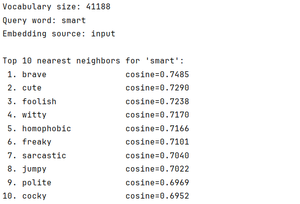

# Word2Vec-Numpy

Classic Word2Vec implementation in pure NumPy from scratch.  
The project uses the **Skip-Gram with Negative Sampling (SGNS)** approach and trains word embeddings on the **IMDB Dataset of 50K Movie Reviews**.

## Structure

- `config.py` - contains dataset, preprocessing, and training hyperparameters
- `preprocess.py` - downloads the dataset from Kaggle, tokenizes text, builds vocabulary, encodes reviews, applies subsampling, and generates skip-gram pairs
- `sampler.py` - implements negative sampling with the unigram distribution raised to the power of 0.75
- `model.py` - implements the SGNS model, including forward pass, loss computation, gradients, and parameter updates
- `train.py` - runs the training loop, logs loss values, and saves training artifacts
- `utils.py` - contains utility functions for saving/loading vocabulary, embeddings, loss history, plotting, and nearest-neighbor search
- `evaluation.py` - loads trained embeddings and prints nearest neighbors for a given word
- `outputs/loss_curve.png` - training loss plot

## Commands to run the project

### 1. Install dependencies
```bash
pip install -r requirements.txt
```

### 2. Train the model
```bash
python train.py
```
This runs preprocessing of the data (downloading and tokenizing).

Then it runs SGNS training and saves:
- vocabulary
- input embeddings
- output embeddings
- loss history
- loss curve plot

### 3. Evaluate embeddings
```bash
python evaluation.py --word movie --top_k 10 --source input
```

This prints the nearest neighbors for a selected word using cosine similarity.

## Config content

`config.py` contains the main hyperparameters and settings:

```python
# Dataset
dataset_slug
dataset_filename

# Vocabulary / preprocessing
min_count
subsample_t

# Model / optimization
embedding_dim
window_size
num_negative
negative_sampling_power
learning_rate
min_learning_rate
epochs

# Reproducibility / logging
seed
print_every
```

## Training objective

The model is trained with **Skip-Gram + Negative Sampling**:

- for each center word, predict real context words inside a fixed window
- sample negative words from the smoothed unigram distribution
- maximize the score of positive `(center, context)` pairs
- minimize the score of sampled negative pairs

## Evaluation

The project uses a simple qualitative evaluation:
- load trained embeddings
- choose a query word
- compute cosine similarity to all other words
- print the top-k nearest neighbors

This helps inspect whether semantically related words are placed close to each other in the embedding space.

## Model weights

After training, the learned weights are available in:
- `outputs/input_embeddings.npy`
- `outputs/output_embeddings.npy`

The main embedding matrix for similarity search is usually `input_embeddings.npy`.

You can see example of my `loss_curve` and `loss_history` in `outputs` folder of repo.

## Example of query for my model:


[Link to my input_embeddings](https://drive.google.com/file/d/1pROSyf3Wnmdz4wu1MiI6zmg1ZqXUIWbn/view?usp=sharing)